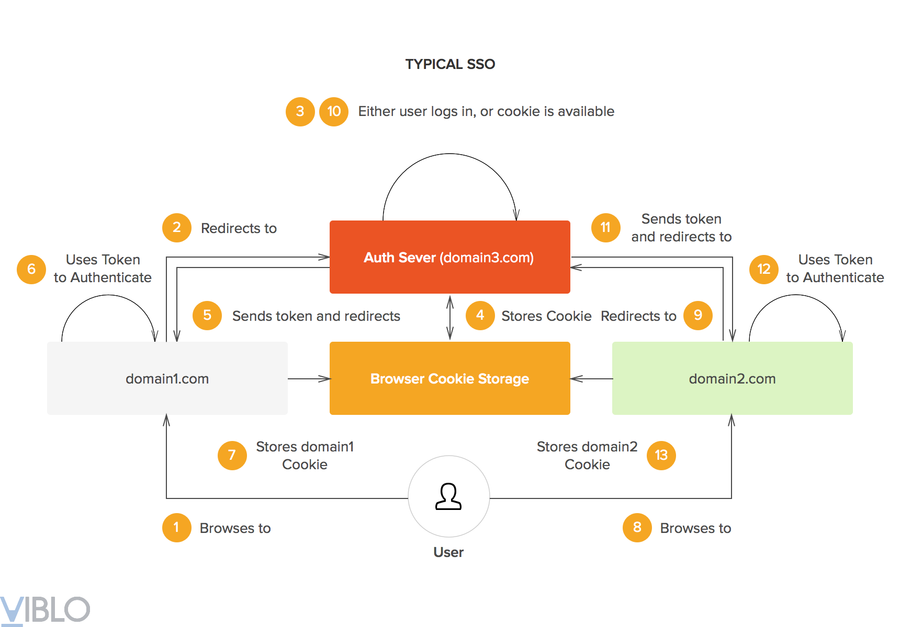

<div id="top"></div>

<br />
<div align="center">
  <h1 align="center">Authentication</h1>
</div>

## Main concept.

- ### SSO (Single Sign-On)

  Single Sign-On, là cơ chế cho phép người dùng có thể truy cập nhiều trang web, ứng dụng mà chỉ cần đăng nhập một lần. Một khi đã được định danh ở một trang website A, thì cũng sẽ được định danh tương tự ở website B mà không cần lặp lại thao tác đăng nhập.

  Một user khi đăng nhập vào hệ thống A thì domain của A sẽ lưu thông tin định danh vào cookie, để user này cũng là đã đăng nhập khi truy cập vào hệ thống B thì domain B sẽ phải đọc được cookie của A tạo ra, nhưng điều này là không thể. Với các trình duyệt hiện nay, domain chỉ có thể truy cập cookie do chính nó tạo ra.

  Mỗi giao thức single sign-on sẽ có cơ chế chia sẻ khác nhau, nhưng điểm chung đều là tạo ra một domain trung tâm (central domain). Qua domain này, thông tin về cookie sẽ được chia sẻ đến các domain con.
  <div align="center">
      
    </div>
    <br />

- ### JWT

  - Symetric vs Asymetric

  ```js
  // Asymetric
  // Use case: Như mô hình SSO bên trên, Auth Server là nơi signed jwt token, và chỉ Auth Server giữ private key. Các service khác có public key để verify nhưng không thể sửa đổi thông tin trong payload
  "use strict";
  const fs = require("fs");
  const jwt = require("jsonwebtoken");

  // Keys generated by http://travistidwell.com/jsencrypt/demo/ and saved to disk.
  // The algorithm must be set to "RS256"

  // Private Key, Public Key (must read as utf8)
  const privateKey = fs.readFileSync("./private.key", "utf8");
  const publicKey = fs.readFileSync("./public.key", "utf8");

  const token = jwt.sign(payload, privateKey, signOptions);

  // Notice the `algorithms: ["RS256"]` which goes with public/private keys
  const verified = jwt.verify(token, publicKey, verifyOptions);
  const decoded = jwt.decode(token, { complete: true });
  ```

  ```js
  // Symetric:
  // Peer-to-peer, cả sender và reciever đều có thể sửa thông tin payload.

  "use strict";
  const jwt = require("jsonwebtoken");

  const secretKey = "shhhhhh";

  const token = jwt.sign(payload, secretKey, signOptions);

  const verified = jwt.verify(token, secretKey, verifyOptions);
  const decoded = jwt.decode(token, { complete: true });
  ```

  - Gồm 3 thành phần: header, payload, signature.
  - Signature = `HMACSHA256(base64UrlEncode(header) + "." + base64UrlEncode(payload), secret)`, nếu dùng thuật toán HMACSHA256. Vì vậy dù có đọc được thông tin payload cũng không để sửa thông tin, do không có `secret` để tạo `Signature` tương ứng.
  - Nên đặt secretKey đủ dài để hạn chế Bruteforcing.

    _Please note the RFC7518 standard states that "A key of the same size as the hash output (for instance, 256 bits for "HS256") or larger MUST be used with this algorithm." Auth0 secret keys exceed this requirement making cracking via this or similar tools all but impossible_

    [Xem thêm](https://auth0.com/blog/brute-forcing-hs256-is-possible-the-importance-of-using-strong-keys-to-sign-jwts/#Brute-Forcing-a-HS256-JSON-Web-Token)

- ### Encrypt Password
- ### Refresh token

  - A refresh token can help you balance security with usability. Since refresh tokens are typically longer-lived, you can use them to request new access tokens after the shorter-lived access tokens expire.
  - We need to have a strategy in place that limits or curtails their usage if they ever get leaked or become compromised.

    - Refresh Token Rotation:

      🐱 Legitimate User uses 🔄 **Refresh Token** to get a **New refresh-access token**

    - Refresh Token Automatic Reuse Detection:

      🐱 Legitimate User uses 🔄 **Refresh Token 1** to get a **New refresh-access token** pair.

      The 🚓 **Auth0 Authorization Server** returns 🔄 **Refresh Token 2** and 🔑 **Access Token 2** to 🐱 Legitimate User.

      😈 Malicious User then attempts to use 🔄 **Refresh Token 1** to get a new access token. Pure evil!

      The 🚓 **Auth0 Authorization Server** has been keeping track of all the refresh tokens descending from the original refresh token. That is, it has created a "token family".

      The 🚓 **Auth0 Authorization Server** recognizes that someone is reusing 🔄 Refresh Token 1 and immediately invalidates the refresh token family, including 🔄 Refresh Token 2.

      The 🚓 **Auth0 Authorization Server** returns an Access Denied response to 😈 Malicious User.

      🔑 **Access Token 2** expires, and 🐱 Legitimate User attempts to use 🔄 **Refresh Token 2** to request a **New refresh-access token** pair.

      The 🚓 **Auth0 Authorization Server** returns an Access Denied response to 🐱 Legitimate User.

- ### Các loại token
- ### REF
  [Single Sign-On (SSO) là gì, hoạt động ra sao?](https://viblo.asia/p/single-sign-on-sso-la-gi-hoat-dong-ra-sao-bWrZn4oQ5xw)
  [What Are Refresh Tokens and How to Use Them Securely](https://auth0.com/blog/refresh-tokens-what-are-they-and-when-to-use-them/#Keeping-Refresh-Tokens-Secure)
  [vladwulf/nestjs-jwts](https://github.com/vladwulf/nestjs-jwts/blob/main/src/auth/auth.service.ts)
  <p align="right">(<a href="#top">Back to top</a>)</p>
