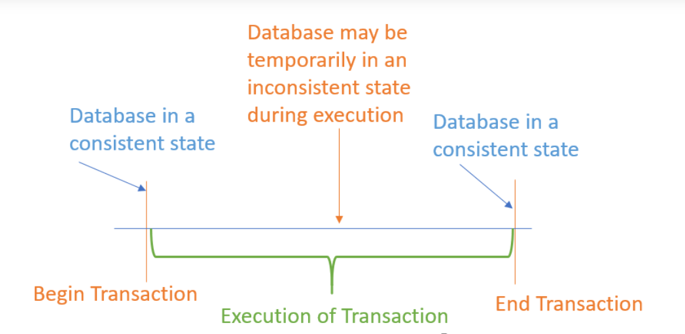

 

  <h1 align="center">Database</h1>

## Main concept.

- ### Redis vs Mongo

  |                                 Redis                                 |                  Mongo                  |
  | :-------------------------------------------------------------------: | :-------------------------------------: |
  |                          Cache data, session                          |                   \_                    |
  |                             Store in Ram                              |              Store in Disk              |
  |                            Key-Value Store                            |             Document Store              |
  | Supports both Master-Slave Replication and Master-Master Replication. | Supports only Master-Slave Replication. |
  |               Redis does not support Map Reduce method                |   MongoDB supports Map Reduce method.   |

- ### ACID

  - #### What is Database Transaction?
    

      
    

     
  - Atomicity
  - Consistency

- ### CAP
- ### BASE
- ### Chuẩn 1, 2, 3

## Classification

[DB-Engines](https://db-engines.com/en/ranking)

(<a href="#top">Back to top</a>)

 

  <h1 align="center">Database</h1>

## Main concept.

- ### Redis vs Mongo

  |                                 Redis                                 |                  Mongo                  |
  | :-------------------------------------------------------------------: | :-------------------------------------: |
  |                          Cache data, session                          |       Powerful set of query tools       |
  |                      Max size of key-value 512Mb                      |      Max size if document is 16MB       |
  |                             Store in Ram                              |              Store in Disk              |
  |                      Database Size depend in Ram                      |                                         |
  |                            Key-Value Store                            |             Document Store              |
  | Supports both Master-Slave Replication and Master-Master Replication. | Supports only Master-Slave Replication. |
  |               Redis does not support Map Reduce method                |   MongoDB supports Map Reduce method.   |

- ### ACID

  - #### What is Database Transaction?
    

      
    

     
  - Atomicity
  - Consistency

- ### CAP
- ### BASE
- ### Chuẩn 1, 2, 3

## Classification

[DB-Engines](https://db-engines.com/en/ranking)

(<a href="#top">Back to top</a>)

