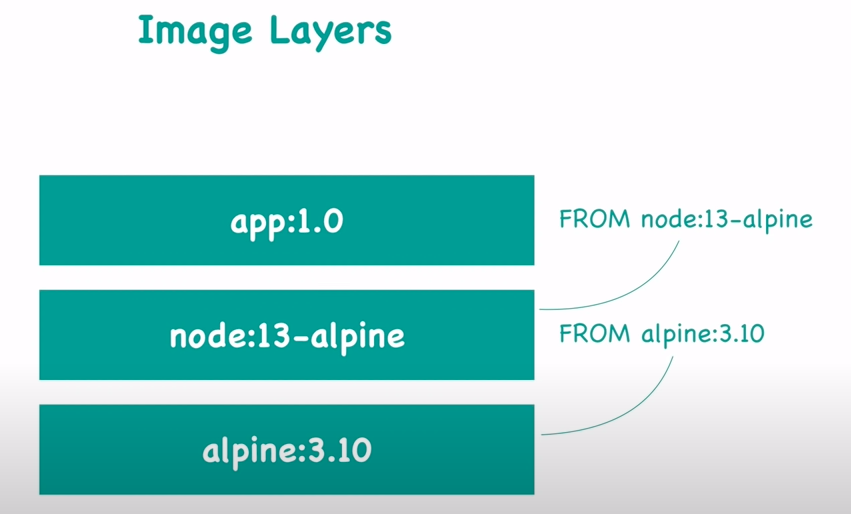
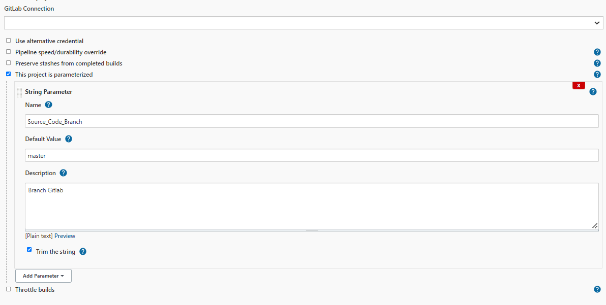

<div id="top"></div>

<br />
<div align="center">
  <h1 align="center">Deployment</h1>
</div>

# Docker

### Container

- A way to package application with all the nesscessary dependencies and configuration.

- Portable artifact, easily shared and moved around.

  |           Docker image            |                  Docker container                   |
  | :-------------------------------: | :-------------------------------------------------: |
  | The actual package of application | When pull that image on my local machine and run it |
  |            Not running            |                       Running                       |

### Image Layer

  <div align="center">
    
  </div>

Các layer có thể share giữa các image. Vì vậy khi pull app:2.0, nếu vẫn sử dụng các layer `node:13-alpine` thì image `node:13-alpine` không cần pull lại.

### Container Port

- 1 application có thể expose ra nhiều port:

  Ví dụ:

  - http: 8080
  - grpc: 8081

  → 1 image config nhiều port (config `expose` trong dockerFile) để build.

  → 1 container khi run expose nhiều port.

  → 1 container cần map nhiều port ra host (machine).

  ```sh
  -p 3000:8080 -p 3001:8081
  ```

- Các container có thể expose trùng port nhau, vì chúng độc lập với nhau.

### Docker Network

- _Docker network sẽ đảm nhiệm nhiệm vụ kết nối mạng giữa các container với nhau, kết nối giữa container với bên ngoài, cũng như kết nối giữa các cụm (swarm) docker containers._

  ```sh
  docker network create <network_name>
  docker run --network <network_name> <image>

  docker network inspect <network_name>
  ```

  ```sh
  # Terminal
  # create network
  docker network create mongodb-network

  # start mongodb
  # If want to expose port ->  host: -p 27017:27017
  docker run --rm -d \
  --network mongodb-network \
  --name mongodb mongo

  #start mongo-express
  docker run --rm -d \
  --network mongodb-network \
  --name mongo-express \
  -e ME_CONFIG_MONGODB_SERVER=mongodb \
  -e ME_CONFIG_MONGODB_PORT=27017 \
  -p 8081:8081 mongo-express
  ```

  ```yaml
  # Docker compose
  version: "3"
  services:
    mongodb:
      image: mongo
      networks:
        - mongodb-network
    mongo-express:
      image: mongo-express
      depends_on:
        - mongodb
      ports:
        - 8080:8081
      environment:
        - ME_CONFIG_MONGODB_SERVER=mongodb
        - ME_CONFIG_MONGODB_PORT=27017
      networks:
        - mongodb-network
  networks:
    mongodb-network:
      driver: bridge
  ```

### Docker volume

- Persistence data from `Virtual File System` (container) -> `Host File System` (Physical)

- Có 3 kiểu:
  - Host Volumes
  - Anonymous Volumes
  - Named Volumes: reference the volume by name, shold use in production 🌟.

```yaml
#Docker compose
version: "3"
services:
  mongodb:
    image: mongo
    volumes:
      - mongo_data1:/data/db
volumes:
  mongo_data1:
    driver: local
```

### Docker compose

```yaml
version: '3'
services:
   mongodb:
    image: mongo
    networks:
    - mongodb-network
    volumes:
    - mongo_data1:/data/db
  mongo-express:
    image: mongo-express
    depends_on:
    - mongodb
    ports:
    - 8080:8081
    environment:
    - ME_CONFIG_MONGODB_SERVER=mongodb
    - ME_CONFIG_MONGODB_PORT=27017
    networks:
    - mongodb-network
networks:
  mongodb-network:
    driver: bridge
volumes:
  mongo_data1:
    driver: local
```

```sh
docker-compose -f <file.yaml> up -d
docker-compose -f <file.yaml> down
```

### Docker File

- Các step chạy trong docker file chạy tuần tự từ trên xuống, và các step sẽ được cache lại. Do đó, khi build lại image, docker chỉ build lại những step có sự thay đổi.
- Từ lí do trên, ta nên tách làm 2 step khi build ứng dụng nodejs
  - Copy package.json file + install
  - Copy code + build

### Some Commands

- Get all container (running & not running)
  ```sh
  docker ps -a
  ```
- `docker run` = `docker pull` + `docker start`
  - `docker run` is to create a new container
  - `docker start` is to restart a stopped container, will retain all the attributes when we create.
- Run in background
  ```sh
  docker run -d <image_name>
  ```
- Restart container

  ```sh
  docker stop <container_ID>

  # docker ps -a
  # if you forgot <container_ID>

  docker start <container_ID>
  ```

- Binding port application to hosts machine

  ```sh
  # $ docker stop <container_ID>
  # stop if container is running

  docker run -p6000:6379 <image_name>
  # 0.0.0.0:6000 -> 6379/tcp
  ```

- Logs

  ```sh
  # $ docker run -d <image_name>

  docker logs <container_ID>
  ```

- Inside the container
  ```sh
  docker exec -it <container_ID> /bin/bash
  ```

# Kubernetes

## Main K8s Components

- ### Node & Pod
  #### Node
  #### Pod
  - Pod always restart when application `crash` or `end` (process done and exit).
  - Cannot delete pods with `kubectl delete pod <pod_name>` command, K8S will auto create new pods to ensure `replicas` number of deployment has no change. [Solve here!](#edit--delele-poddeployment)
- ### Service

  An abstract way to expose an application running on a set of Pods as a network service.

  - Load Balancer Services
    <div align="center">
      

    Connect: 10.128.233.2:3200

    </div>

  - NodePort Services
    <div align="center">
      

    Connect: 172.90.1.2:30008

    </div>
    Nếu cluster có nhiều node, có thể truy cập bằng IP của node bất kì.

  - ClusterIP Services
  - Headless Services

- ### Ingress
  - Ingress may provide load balancing, SSL termination and name-based virtual hosting, combine services.
    - Combine services.
      ```yaml
      # .spec.rules
      - http:
          paths:
            - path: /a
              pathType: Prefix
              backend:
                service:
                  name: testA
                  port:
                    number: 80
            - path: /b
              pathType: Prefix
              backend:
                service:
                  name: testB
                  port:
                    number: 80
      ```
      - Name-based virtual hosting
      ```yaml
      # .spec.rules
      - host: "foo.bar.com"
        http:
          paths:
          ...
      ```
- ### ConfigMap & Secret
- ### Volumes
  - Khi `accessModes: ReadWriteOne` thì pods muốn truy cập PV này phải cùng 1 node. `accessModes: ReadWriteMany` thì cho phép nhiều node.
- ### Deployment & StatefulSet & DaemonSet

  #### Deployment

  ```yaml
  #deployment.yaml
  apiVersion: apps/v1
  kind: Deployment
  metadata:
    name: hello
  spec:
    replicas: 2
  ```

  A Deployment provides declarative updates for Pods and ReplicaSets.

  Sử dụng Deployment thường được sử dụng cho các ứng dụng stateless, bạn cũng có thể lưu trạng thái triển khai bằng cách gắn cho nó một Persistent Volume và làm cho nó trở thành stateful. Nhưng lưu ý là ở đây tất cả các Pod của bạn sẽ cùng chia sẻ một Volume và dữ liệu của chúng cũng sẽ tương tự nhau.

  1 deployment scale 50 relicas thì chạy oke, vì nó scale từ từ 1 -> 2 -> 3... Chạy 50 cái deployment đồng thời thì server chết, vì được start đồng thời.

  #### StatefulSet

  ```yaml
  #deamonset.yaml
  apiVersion: apps/v1
  kind: DaemonSet
  ```

  #### DeamonSets

  ```yaml
  #deamonset.yaml
  apiVersion: apps/v1
  kind: DaemonSet
  ```

  A DaemonSet ensures that all (or some) Nodes run a copy of a Pod. As nodes are added to the cluster, Pods are added to them. As nodes are removed from the cluster, those Pods are garbage collected.

  Tương tự như một Deployment, tức là tất cả các Pod cũng sẽ cùng chia sẻ một Persistent Volume.

## Main Kubectl Commands - K8s CLI

- ### Get status of different components
  ```sh
  kubectl get node|namespace|deployment|pods|services|ingress|replicaset
  ```
- ### Create pod/deployment
  ```sh
  kubectl create deployment <deployment_name> --image=image_name --replicas=2 [options]
  ```
  or
  ```sh
  kubectl apply -f <file_name>
  ```
- ### Edit | Delele pod/deployment
  ```sh
  kubectl edit|delete deployment <deployment_name>
  ```
  or
  ```sh
  kubectl edit|delete -f <file_name>
  ```
- ### Debugging pods
  ```sh
  kubectl logs <pod_name>
  ```
- ### Get interactive terminal
  ```sh
  kubectl exec -it <pod_name> -- bin/bash
  ```
- ### Get information about pod

  ```sh
  kubectl describe pod <pod_name>
  ```

  All commands above run with `default` namespace, if we want to run with other namespace, add parameter `-n namepace_name`

<p align="right">(<a href="#top">Back to top</a>)</p>

# Helm

## Main Helm Commands

- Check template

  ```sh
  helm template [NAME] [CHART] [flags]

  helm template . --values values.yaml --values values.testing.yaml
  ```

- Install

  ```sh
  helm install [NAME] [CHART] [flags]

  helm install nestjs-core . --values values.yaml --values values.testing.yaml
  ```

- Install

  ```sh
  helm upgrade [RELEASE] [CHART] [flags]

  helm upgrade nestjs-core . --values values.yaml --set image.tag=123
  ```

  <p align="right">(<a href="#top">Back to top</a>)</p>

# Jenkins

## Set up jenkins in k8s cluster (_v1.21.9_)

```yaml
# jenkins-deployment.yaml
apiVersion: apps/v1
kind: Deployment
metadata:
  name: jenkins
spec:
  replicas: 1
  selector:
    matchLabels:
      app: jenkins
  template:
    metadata:
      labels:
        app: jenkins
    spec:
      containers:
        - name: jenkins
          image: jenkins/jenkins:2.60.3
          ports:
            - containerPort: 8080
          volumeMounts:
            - name: jenkins-home
              mountPath: /var/jenkins_home
      volumes:
        - name: jenkins-home
          emptyDir: {}
---
apiVersion: v1
kind: Service
metadata:
  name: jenkins
spec:
  type: NodePort
  ports:
    - port: 8080
      targetPort: 8080
  selector:
    app: jenkins
```

```sh
kubectl apply -f jenkins-deployment.yaml
```

## Connect with webhooks Gitlab

- Install some plugin

  - [Git plugin](https://plugins.jenkins.io/git)
  - [Credentials Plugin](https://plugins.jenkins.io/credentials)
  - [GitLab](https://plugins.jenkins.io/gitlab-plugin)
  - [Gitlab API](https://plugins.jenkins.io/gitlab-api)
  - [GitLab Authentication](https://plugins.jenkins.io/gitlab-oauth)

- Create Gitlab credential

  Manage Jenkins → Manage credentials → global (maybe) → Add Credentials

  <div align="center">
    
  </div>
  <br />

  _Username:_ `username` of Gitlab

  _Password:_ `password` of Gitlab

- Create new Item

  - New Item → Pipeline

    - → Build when a change is pushed to GitLab. GitLab webhook URL: http://host/project/item_name’ → advanced → Generate.

    <div align="center">
      
    </div>
    <br />

    - → Pipeline script in SCM (_Definition_) → Git (_SCM_) → enter HTTPS Gitlab URL, pick credential

    <div align="center">
      
    </div>
    <br />

- Config Webhooks Gitlab
  <div align="center">
    
  </div>
  Save & Test Push event

## 3. Use Kubernetes Pods As Jenkins Agents.

- Install plugin k8s
  - [Kubernetes](https://plugins.jenkins.io/kubernetes/)
- Solution 1:
  Manage Jenkins → Manage Nodes and Clouds → Configure Clouds → kubernetes
  <div align="center">
    
  </div>
  <br />

  _Get Kubernetes URL:_ `kubectl cluster-info`

  _Credentials:_ `config file` of K8s

- Solution 2:

  - [How to Use Kubernetes Pods As Jenkins Agents](https://www.youtube.com/watch?v=ZXaorni-icg)
  - Sumary

    ```sh
    kubectl create namespace jenkins

    kubectl create serviceaccount jenkins --namespace=jenkins

    kubectl describe secret $(kubectl describe serviceaccount jenkins --namespace=jenkins | grep Token | awk '{print $2}') --namespace=jenkins

    kubectl create rolebinding jenkins-admin-binding --clusterrole=admin --serviceaccount=jenkins:jenkins --namespace=jenkins
    ```

  - Troubleshooting
    - 403 cluster
      ```sh
      kubectl create clusterrolebinding jenkins --clusterrole cluster-admin --serviceaccount=jenkins:default
      ```

## Pipeline

- Run one when start Project
  ```sh
  helm install nestjs-core ./k8s/helm/chart --values ./k8s/helm/chart/values.yaml
  ```
- Jenkins File

  ```groovy
  def dockerImage = 'ngocdv86/nestjs-core'
  def deploymentName = 'nestjs-core'

  podTemplate(
    containers: [
      containerTemplate(name: 'helm', alwaysPullImage: true, image: 'lachlanevenson/k8s-helm:v3.7.2', command: 'cat', ttyEnabled: true),
      containerTemplate(name: 'docker', alwaysPullImage: true, image: 'docker:20.10.8', command: 'cat', ttyEnabled: true, privileged: true),
    ],
    volumes: [
      hostPathVolume(hostPath: '/var/run/docker.sock', mountPath: '/var/run/docker.sock'),
    ],
  ) {
    node(POD_LABEL) {

      def branchName = env.gitlabTargetBranch ? env.gitlabTargetBranch : params.Source_Code_Branch

      stage('checkout') {
        myRepo = checkout scm
        sh 'git branch -r'
        sh "git checkout ${branchName}"
      }

      def lastCommit = env.gitlabAfter ? env.gitlabAfter : sh(script: "git log --format='%H' -n 1", returnStdout: true)
      def dockerImageTag = "${branchName}-${env.BUILD_NUMBER}-${lastCommit}"

      stage('build') {
        container('docker') {
          sh "docker build -t ${dockerImage}:${dockerImageTag} -f Dockerfile . "
          sh "docker image ls | grep ${dockerImage}"
          withCredentials([usernamePassword(credentialsId: 'docker-hub', usernameVariable: 'DOCKER_USERNAME', passwordVariable: 'DOCKER_PASSWORD')]) {
            sh 'echo $DOCKER_PASSWORD | docker login --username $DOCKER_USERNAME --password-stdin'
            sh "docker push ${dockerImage}:${dockerImageTag}"
          }
          sh "docker image rm ${dockerImage}:${dockerImageTag}"
        }
      }

      stage('deploy') {
        container('helm') {
          withCredentials([file(credentialsId: 'jenkins-file', variable: 'config')]) {
            sh "export KUBECONFIG=\${config}"
            sh "helm upgrade ${deploymentName}  ./k8s/helm/chart --values ./k8s/helm/chart/values.yaml --set image.tag=${dockerImageTag}"
          }
        }
      }
    }
  }
  ```

- Some notes
  - Check environment
    ```sh
    sh 'printenv'
    ```
  - Build project is parameterized
    <div align="center">
      
    </div>
    <br />
  - Troubleshooting
    - Error: UPGRADE FAILED: query: failed to query with labels: secrets is forbidden: User "system:serviceaccount:default:default" cannot list resource "secrets" in API group "" in the namespace "default"
      ```sh
      kubectl create clusterrolebinding default --clusterrole cluster-admin --serviceaccount=default:default
      ```

# Ref

- [Kubernetes Tutorial for Beginners](https://www.youtube.com/watch?v=X48VuDVv0do)
- [Complete Jenkins Pipeline Tutorial](https://www.youtube.com/watch?v=7KCS70sCoK0)
- [Docker Build inside Jenkins Build Agent](https://github.com/jenkinsci/kubernetes-operator/issues/21)
- [How To Integrate GitLab With Jenkins](https://www.youtube.com/watch?v=-O4tiLzYJMI)
- [[Kubernetes] So sánh giữa Deployments, StatefulSets và DaemonSets. Khi nào nên sử dụng chúng?](https://viblo.asia/p/kubernetes-so-sanh-giua-deployments-statefulsets-va-daemonsets-khi-nao-nen-su-dung-chung-ORNZqXd3K0n)
<p align="right">(<a href="#top">Back to top</a>)</p>
