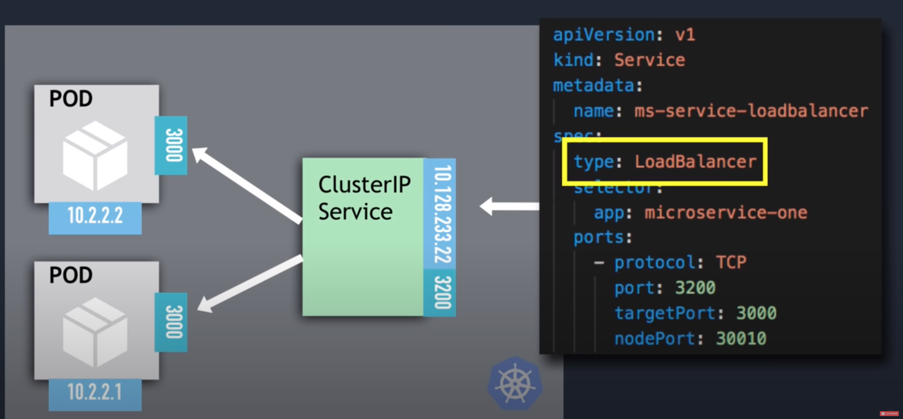
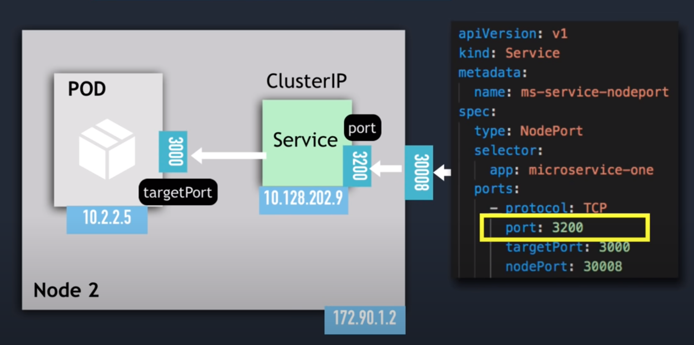

<div id="top"></div>

<br />
<div align="center">
  <h1 align="center">Deployment</h1>
</div>

# Kubernetes

## Common command

- Get
  ```sh
  kubectl get node|deployment|pods|services|ingress|replicaset
  ```
- Create deployment
  ```sh
  kubectl create deployment deployment_name --image=image_name --replicas=2 [options]
  ```
  or
  ```sh
  kubectl apply -f file_name
  ```
- Edit | Delele deployment
  ```sh
  kubectl edit|delete deployment deployment_name
  ```
- Edit | Delele deployment with file
  ```sh
  kubectl edit|delete -f file_name
  ```
- Delete pod
  ```sh
  kubectl delete pod pod_name
  ```
  - K8s sẽ tự động start lại pod mới để đảm bảo số pod bằng với thông số replica của deplo10.128.233.2yment
  - Muốn xóa hoàn toàn pod thì phải xóa deployment
- Delete service
  ```sh
  kubectl delete service service_name
  ```
- Log pod to console
  ```sh
  kubectl logs pod_name
  ```
- Get interactive terminal
  ```sh
  kubectl exec -it pod_name -- bin/bash
  ```
- Get information about pod
  ```sh
  kubectl describe pod pod_name
  ```

## Services

- Load Balancer Service
    <div align="center">
        

        Connect: 10.128.233.2:3200

    </div>

- NodePort Service
    <div align="center">
        

        Connect: 192.90.1.2:30008

    </div>

## Volumes

Khi `accessModes: ReadWriteOne` thì pods muốn truy cập PV này phảu cùng 1 node. `accessModes: ReadWriteMany` thì cho phép nhiều node.

# Helm

## Common

- Check template

  ```sh
  helm template . --values values.yaml --values values.testing.yaml
  ```

- Install
  ```sh
  helm install nestjs-core . --values values.yaml --values values.testing.yaml
  ```

## Some mistake error

- 403 cluster
  ```sh
  kubectl create clusterrolebinding jenkins --clusterrole cluster-admin --serviceaccount=jenkins:default
  ```

<p align="right">(<a href="#top">Back to top</a>)</p>
