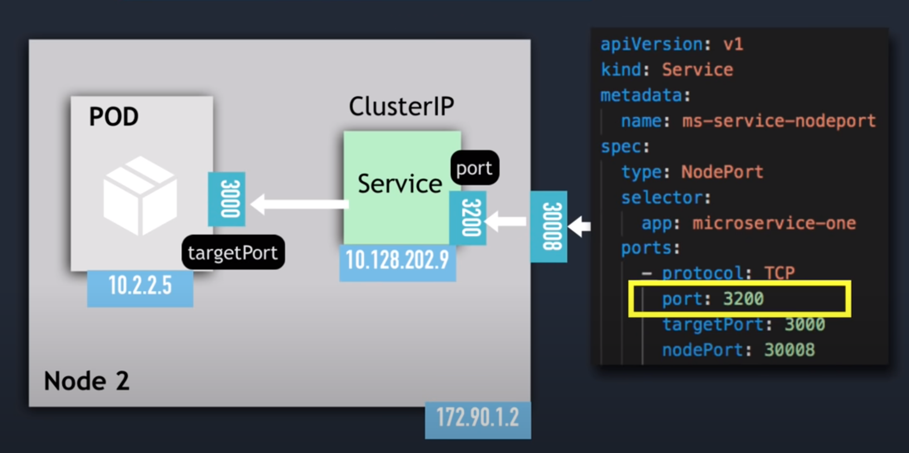
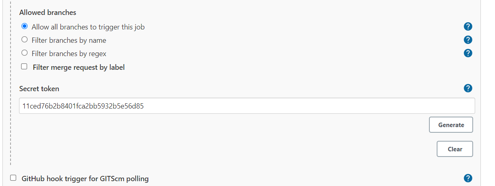
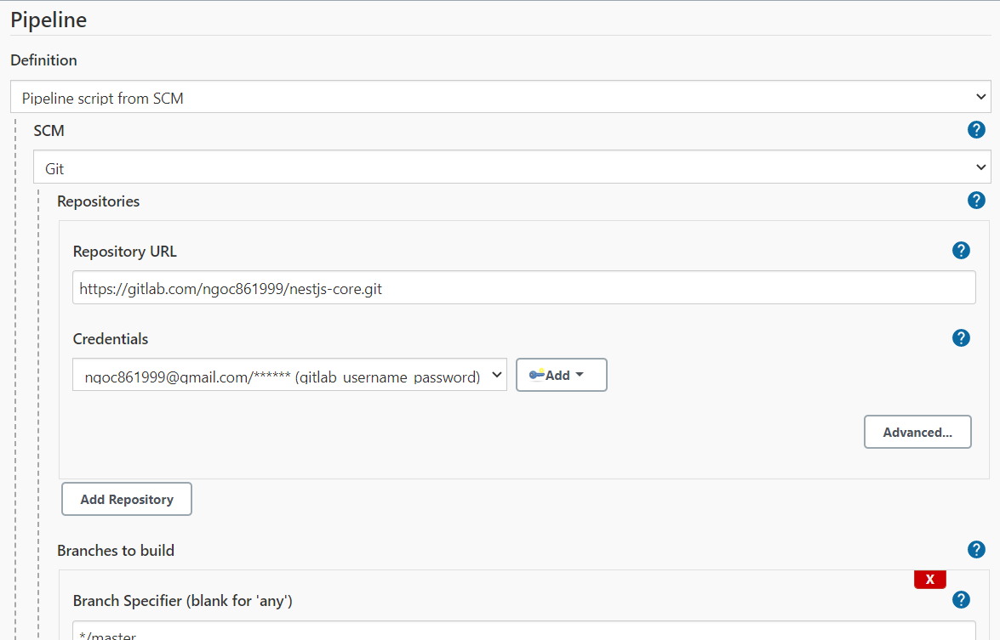
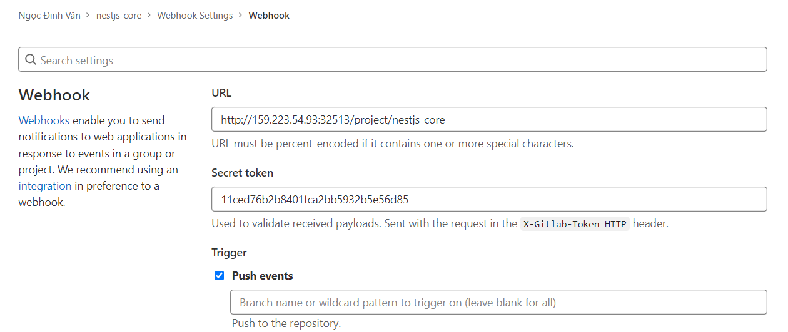
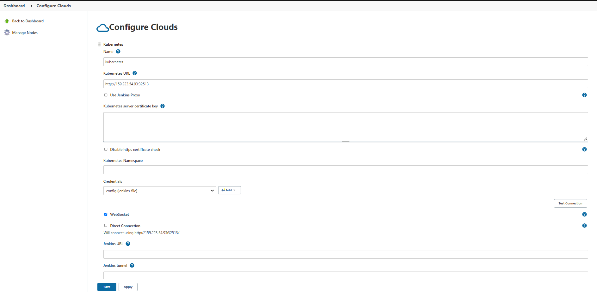

<div id="top"></div>

<br />
<div align="center">
  <h1 align="center">Deployment</h1>
</div>

# Kubernetes

## Common command

- Get
  ```sh
  kubectl get node|namespace|deployment|pods|services|ingress|replicaset
  ```
- Create deployment
  ```sh
  kubectl create deployment deployment_name --image=image_name --replicas=2 [options]
  ```
  or
  ```sh
  kubectl apply -f file_name
  ```
- Edit | Delele deployment
  ```sh
  kubectl edit|delete deployment deployment_name
  ```
- Edit | Delele deployment with file
  ```sh
  kubectl edit|delete -f file_name
  ```
- Delete pod
  ```sh
  kubectl delete pod pod_name
  ```
  - K8s sẽ tự động start lại pod mới để đảm bảo số pod bằng với thông số replica của deployment
  - Muốn xóa hoàn toàn pod thì phải xóa deployment
- Delete service
  ```sh
  kubectl delete service service_name
  ```
- Log pod to console
  ```sh
  kubectl logs pod_name
  ```
- Get interactive terminal
  ```sh
  kubectl exec -it pod_name -- bin/bash
  ```
- Get information about pod
  ```sh
  kubectl describe pod pod_name
  ```

## Services

- Load Balancer Services
    <div align="center">
      

      Connect: 10.128.233.2:3200

    </div>

- NodePort Services
    <div align="center">
      

      Connect: 192.90.1.2:30008

    </div>

- ClusterIP Services
- Headless Services

## Volumes

Khi `accessModes: ReadWriteOne` thì pods muốn truy cập PV này phải cùng 1 node. `accessModes: ReadWriteMany` thì cho phép nhiều node.

# Helm

## Common command

- Check template

  ```sh
  helm template . --values values.yaml --values values.testing.yaml
  ```

- Install
  ```sh
  helm install nestjs-core . --values values.yaml --values values.testing.yaml
  ```

# Jenkins

## 1. Set up jenkins in k8s cluster (_v1.21.9_)

- Make jenkins-deployment.yaml file.
  ```yaml
  apiVersion: apps/v1
  kind: Deployment
  metadata:
    name: jenkins
  spec:
    replicas: 1
    selector:
      matchLabels:
        app: jenkins
    template:
      metadata:
        labels:
          app: jenkins
      spec:
        containers:
          - name: jenkins
            image: jenkins/jenkins:2.60.3
            ports:
              - containerPort: 8080
            volumeMounts:
              - name: jenkins-home
                mountPath: /var/jenkins_home
        volumes:
          - name: jenkins-home
            emptyDir: {}
  ---
  apiVersion: v1
  kind: Service
  metadata:
    name: jenkins
  spec:
    type: NodePort
    ports:
      - port: 8080
        targetPort: 8080
    selector:
      app: jenkins
  ```
- Deploy Jenkins service
  ```sh
  kubectl apply -f jenkins-deployment.yaml
  ```

## 2. Connect with webhooks Gitlab

- Install some plugin

  - [GitLab](https://plugins.jenkins.io/gitlab-plugin)
  - [Gitlab API](https://plugins.jenkins.io/gitlab-api)
  - [GitLab Authentication](https://plugins.jenkins.io/gitlab-oauth)

- Create Gitlab credential

  Manage Jenkins → Manage credentials → global (maybe) → Add Credentials

  <div align="center">
    
  </div>

- Create new Item

  - New Item → Pipeline

    - → Build when a change is pushed to GitLab. GitLab webhook URL: http://host/project/item_name’ → advanced → Generate.

    <div align="center">
      
    </div>

    - → Pipeline script in SCM (_Definition_) → Git (_SCM_) → Enter HTTPS Gitlab Url, Pick credential

    <div align="center">
      
    </div>

- Config Webhooks Gitlab
  <div align="center">
    
  </div>

  Save & Test Push event

## 3. Use Kubernetes Pods As Jenkins Agents.

- Install plugin k8s
  - [Kubernetes](https://plugins.jenkins.io/kubernetes/)
- Solution 1:
  Manage Jenkins → Manage Nodes and Clouds → Configure Clouds → kubernetes
  <div align="center">
    
  </div>

  - Get Kubernetes URL
    ```sh
    kubectl cluster-info
    ```
  - Credentials is `config file` of K8s

- Solution 2:

  - [How to Use Kubernetes Pods As Jenkins Agents](https://www.youtube.com/watch?v=ZXaorni-icg)
  - Sumary

    ```sh
    kubectl create namespace jenkins

    kubectl create serviceaccount jenkins --namespace=jenkins

    kubectl describe secret $(kubectl describe serviceaccount jenkins --namespace=jenkins | grep Token | awk '{print $2}') --namespace=jenkins

    kubectl create rolebinding jenkins-admin-binding --clusterrole=admin --serviceaccount=jenkins:jenkins --namespace=jenkins
    ```

  - Troubleshooting
    - 403 cluster
      ```sh
      kubectl create clusterrolebinding jenkins --clusterrole cluster-admin --serviceaccount=jenkins:default
      ```

# Ref

- [Kubernetes Tutorial for Beginners](https://www.youtube.com/watch?v=X48VuDVv0do)
    <p align="right">(<a href="#top">Back to top</a>)</p>
