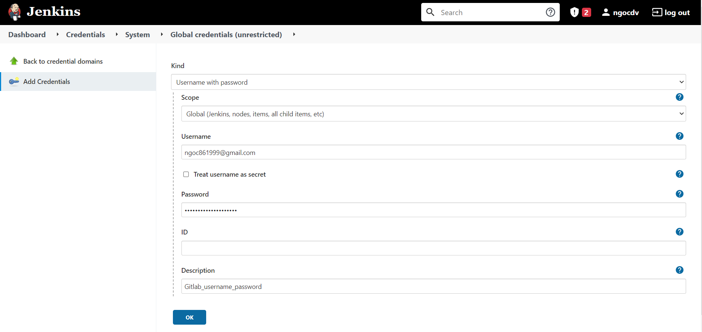

<div id="top"></div>

<br />
<div align="center">
  <h1 align="center">Deployment</h1>
</div>

# Kubernetes

## Main K8s Components

- ### Node & Pod
- ### Service

  - Load Balancer Services
    <div align="center">
      

    Connect: 10.128.233.2:3200

    </div>

  - NodePort Services
    <div align="center">
      

    Connect: 172.90.1.2:30008

    </div>

  - ClusterIP Services
  - Headless Services

- ### Ingress
- ### ConfigMap & Secret
- ### Volumes
  - Khi `accessModes: ReadWriteOne` thì pods muốn truy cập PV này phải cùng 1 node. `accessModes: ReadWriteMany` thì cho phép nhiều node.
- ### Deployment & StatefulSet

## Main Kubectl Commands - K8s CLI

- ### Get status of different components
  ```sh
  kubectl get node|namespace|deployment|pods|services|ingress|replicaset
  ```
- ### Create pod/deployment
  ```sh
  kubectl create deployment <deployment_name> --image=image_name --replicas=2 [options]
  ```
  or
  ```sh
  kubectl apply -f <file_name>
  ```
- ### Edit | Delele pod/deployment
  ```sh
  kubectl edit|delete deployment <deployment_name>
  ```
  or
  ```sh
  kubectl edit|delete -f <file_name>
  ```
- ### Debugging pods
  ```sh
  kubectl logs <pod_name>
  ```
- ### Get interactive terminal
  ```sh
  kubectl exec -it <pod_name> -- bin/bash
  ```
- ### Get information about pod

  ```sh
  kubectl describe pod <pod_name>
  ```

  All commands above run with `default` namespace, if we want to run with other namespace, add parameter `-n namepace_name`

  Cannot delete pods with `kubectl delete pod <pod_name>` command, K8S will auto create new pods to ensure `replica` number of deployment has no change. [Solve here!](#edit--delele-poddeployment)

<p align="right">(<a href="#top">Back to top</a>)</p>

# Helm

## Main Helm Commands

- Check template

  ```sh
  helm template [NAME] [CHART] [flags]

  helm template . --values values.yaml --values values.testing.yaml
  ```

- Install

  ```sh
  helm install [NAME] [CHART] [flags]

  helm install nestjs-core . --values values.yaml --values values.testing.yaml
  ```

- Install

  ```sh
  helm upgrade [RELEASE] [CHART] [flags]

  helm upgrade nestjs-core . --values values.yaml --set image.tag=123
  ```

  <p align="right">(<a href="#top">Back to top</a>)</p>

# Jenkins

## Set up jenkins in k8s cluster (_v1.21.9_)

```yaml
# jenkins-deployment.yaml
apiVersion: apps/v1
kind: Deployment
metadata:
  name: jenkins
spec:
  replicas: 1
  selector:
    matchLabels:
      app: jenkins
  template:
    metadata:
      labels:
        app: jenkins
    spec:
      containers:
        - name: jenkins
          image: jenkins/jenkins:2.60.3
          ports:
            - containerPort: 8080
          volumeMounts:
            - name: jenkins-home
              mountPath: /var/jenkins_home
      volumes:
        - name: jenkins-home
          emptyDir: {}
---
apiVersion: v1
kind: Service
metadata:
  name: jenkins
spec:
  type: NodePort
  ports:
    - port: 8080
      targetPort: 8080
  selector:
    app: jenkins
```

```sh
kubectl apply -f jenkins-deployment.yaml
```

## Connect with webhooks Gitlab

- Install some plugin

  - [Git plugin](https://plugins.jenkins.io/git)
  - [Credentials Plugin](https://plugins.jenkins.io/credentials)
  - [GitLab](https://plugins.jenkins.io/gitlab-plugin)
  - [Gitlab API](https://plugins.jenkins.io/gitlab-api)
  - [GitLab Authentication](https://plugins.jenkins.io/gitlab-oauth)

- Create Gitlab credential

  Manage Jenkins → Manage credentials → global (maybe) → Add Credentials

  <div align="center">
    
  </div>
  <br />

  _Username:_ `username` of Gitlab

  _Password:_ `password` of Gitlab

- Create new Item

  - New Item → Pipeline

    - → Build when a change is pushed to GitLab. GitLab webhook URL: http://host/project/item_name’ → advanced → Generate.

    <div align="center">
      
    </div>
    <br />

    - → Pipeline script in SCM (_Definition_) → Git (_SCM_) → enter HTTPS Gitlab URL, pick credential

    <div align="center">
      
    </div>
    <br />

- Config Webhooks Gitlab
  <div align="center">
    
  </div>
  Save & Test Push event

## 3. Use Kubernetes Pods As Jenkins Agents.

- Install plugin k8s
  - [Kubernetes](https://plugins.jenkins.io/kubernetes/)
- Solution 1:
  Manage Jenkins → Manage Nodes and Clouds → Configure Clouds → kubernetes
  <div align="center">
    
  </div>
  <br />

  _Get Kubernetes URL:_ `kubectl cluster-info`

  _Credentials:_ `config file` of K8s

- Solution 2:

  - [How to Use Kubernetes Pods As Jenkins Agents](https://www.youtube.com/watch?v=ZXaorni-icg)
  - Sumary

    ```sh
    kubectl create namespace jenkins

    kubectl create serviceaccount jenkins --namespace=jenkins

    kubectl describe secret $(kubectl describe serviceaccount jenkins --namespace=jenkins | grep Token | awk '{print $2}') --namespace=jenkins

    kubectl create rolebinding jenkins-admin-binding --clusterrole=admin --serviceaccount=jenkins:jenkins --namespace=jenkins
    ```

  - Troubleshooting
    - 403 cluster
      ```sh
      kubectl create clusterrolebinding jenkins --clusterrole cluster-admin --serviceaccount=jenkins:default
      ```

## Pipeline

- Run one when start Project
  ```sh
  helm install nestjs-core ./k8s/helm/chart --values ./k8s/helm/chart/values.yaml
  ```
- Jenkins File

  ```groovy
  def dockerImage = 'ngocdv86/nestjs-core'
  def deploymentName = 'nestjs-core'

  podTemplate(
    containers: [
      containerTemplate(name: 'helm', alwaysPullImage: true, image: 'lachlanevenson/k8s-helm:v3.7.2', command: 'cat', ttyEnabled: true),
      containerTemplate(name: 'docker', alwaysPullImage: true, image: 'docker:20.10.8', command: 'cat', ttyEnabled: true, privileged: true),
    ],
    volumes: [
      hostPathVolume(hostPath: '/var/run/docker.sock', mountPath: '/var/run/docker.sock'),
    ],
  ) {
    node(POD_LABEL) {

      def branchName = env.gitlabTargetBranch ? env.gitlabTargetBranch : params.Source_Code_Branch

      stage('checkout') {
        myRepo = checkout scm
        sh 'git branch -r'
        sh "git checkout ${branchName}"
      }

      def lastCommit = env.gitlabAfter ? env.gitlabAfter : sh(script: "git log --format='%H' -n 1", returnStdout: true)
      def dockerImageTag = "${branchName}-${env.BUILD_NUMBER}-${lastCommit}"

      stage('build') {
        container('docker') {
          sh "docker build -t ${dockerImage}:${dockerImageTag} -f Dockerfile . "
          sh "docker image ls | grep ${dockerImage}"
          withCredentials([usernamePassword(credentialsId: 'docker-hub', usernameVariable: 'DOCKER_USERNAME', passwordVariable: 'DOCKER_PASSWORD')]) {
            sh 'echo $DOCKER_PASSWORD | docker login --username $DOCKER_USERNAME --password-stdin'
            sh "docker push ${dockerImage}:${dockerImageTag}"
          }
          sh "docker image rm ${dockerImage}:${dockerImageTag}"
        }
      }

      stage('deploy') {
        container('helm') {
          withCredentials([file(credentialsId: 'jenkins-file', variable: 'config')]) {
            sh "export KUBECONFIG=\${config}"
            sh "helm upgrade ${deploymentName}  ./k8s/helm/chart --values ./k8s/helm/chart/values.yaml --set image.tag=${dockerImageTag}"
          }
        }
      }
    }
  }
  ```

- Some notes
  - Check environment
    ```sh
    sh 'printenv'
    ```
  - Build project is parameterized
    <div align="center">
      
    </div>
    <br />
  - Troubleshooting
    - Error: UPGRADE FAILED: query: failed to query with labels: secrets is forbidden: User "system:serviceaccount:default:default" cannot list resource "secrets" in API group "" in the namespace "default"
      ```sh
      kubectl create clusterrolebinding default --clusterrole cluster-admin --serviceaccount=default:default
      ```

# Ref

- [Kubernetes Tutorial for Beginners](https://www.youtube.com/watch?v=X48VuDVv0do)
- [Complete Jenkins Pipeline Tutorial](https://www.youtube.com/watch?v=7KCS70sCoK0)
- [Docker Build inside Jenkins Build Agent](https://github.com/jenkinsci/kubernetes-operator/issues/21)
- [How To Integrate GitLab With Jenkins](https://www.youtube.com/watch?v=-O4tiLzYJMI)
<p align="right">(<a href="#top">Back to top</a>)</p>
