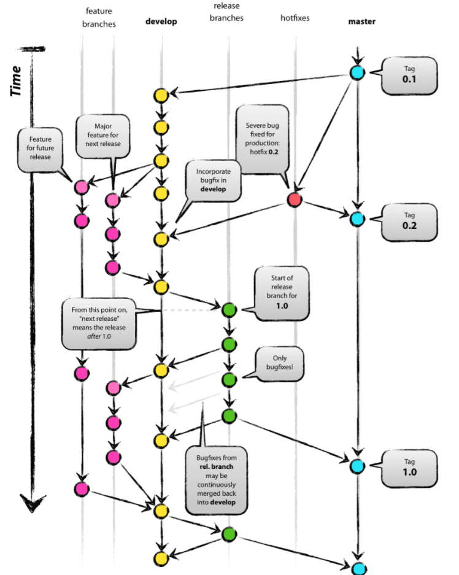
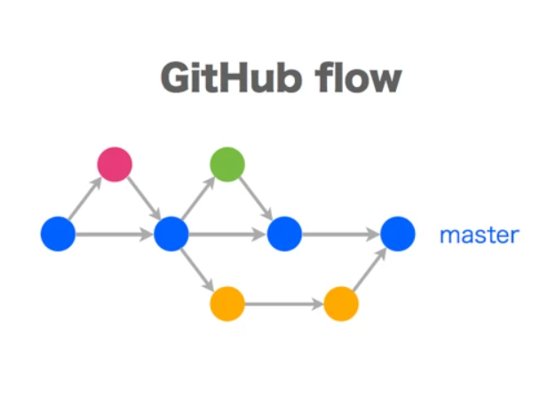

<div id="top"></div>

<br />
<div align="center">
  <h1 align="center">Git</h1>
</div>

## Concept comparison.

- ### Git flow & Github flow & Gitlab flow

  - [Git flow](https://nvie.com/posts/a-successful-git-branching-model/)

    <div align="center">
      
    </div>

  - [Github flow](https://docs.github.com/en/get-started/quickstart/github-flow)

  If your team is doing continuous delivery of software, not rolled back (Web apps), I would suggest to adopt a much simpler workflow (like `GitHub flow`) instead of trying to shoehorn git-flow into your team.
    <div align="center">
      
    </div>
    
  - Gitlab flow

  GitHub flow does assume you are able to deploy to production every time you merge a feature branch, but there are many cases where this is not possible.

    <div align="center">
      
    </div>

- ### Git pull & git fetch

  ```sh
  git branch -a
  # * master
  #   origin/master
  #   remotes/origin/master

  git fetch origin master
  # retrieve origin/master (remote) -> origin/master (local)

  git merge origin/master master
  # merge origin/master (local) -> master (local)

  git pull origin master
  # retrieve & merge origin/master (remote) -> master (local)
  ```

- ### Git merge & rebase

## Most Common Git Commands

- ### Git reset --mixed

  ```sh
  git reset --mixed <commit_id>
  git add .
  git commit -m'commit messages'
  git push -f
  ```

  Merge all commit after `commit_id` (not include `commit_id`) to new commit.

- ### Add new remote git

  ```sh
  # Fetch all
  git branch -r | grep -v '\->' | sed "s,\x1B\[[0-9;]*[a-zA-Z],,g" | while read remote; do git branch --track "${remote#origin/}" "$remote"; done

  git fetch --all
  git pull --all

  # Push to new remote repository
  git remote -v
  git remote add new-origin https://gitlab.com/ngoc861999/socialift.git
  git push -u new-origin --all
  git push -u new-origin --tags
  ```

  _Ref:_

- [What is the difference between GitHub Flow and GitLab Flow?](https://stackoverflow.com/questions/39917843/what-is-the-difference-between-github-flow-and-gitlab-flow)
- [Development Approaches Git Flow and GitHub Flow](https://www.youtube.com/watch?v=w2r0oLFtXAw)
- [Sự khác nhau giữa git fetch và git pull](https://www.youtube.com/watch?v=C2N_tuqDFlw)
  <p align="right">(<a href="#top">Back to top</a>)</p>
