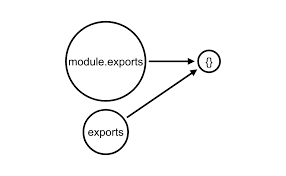

<div id="top"></div>

<br />
<div align="center">
  <h1 align="center">JavaScript</h1>
</div>

## Concept comparison.

- #### **ES6** vs **CommonJS**

  - ES6 → `import`, `export default` | `export`

    - `package.json` file must contain `"type": "module"` if want to use ES6
    - _export default_

      ```js
      // hello.js
      function hello() {
        return 👋;
      }
      export default hello;

      // app.js
      import hello from "./hello";
      hello(); //return 👋
      ```

      A module cannot have multiple default exports.

    - _export_

      ```js
      // hello.js
      class a{};
      class b{};
      class c{};

      export a;

      //can combine with
      export {b, c};

      // app.js
      import {a, b, c} from "./hello";
      ```

  - CommonJS → `require`, `module.exports` | `exports`

    > Should use: `module.exports`

    Both of them are references to the same (empty) object at the beginning. But only `module.exports` will be returned.

    <div align="center">
      
    </div>

    - _module.exports_

      ```js
      // test.js
      module.exports = User;

      // app.js
      const User = require("./test");
      new User();
      ```

      ```js
      // test.js
      module.exports = {
        a: 1,
        b: 2,
      };

      // or
      module.exports.c = 3;

      // app.js
      const { a, b, c } = require("./test");
      console.log(a, b, c); // 1 2 3
      ```

    - _exports_

      ```js
      // test.js
      exports.a = 1;

      module.exports.b = 2; // We can combine with module.exports because both of them reference the same object.

      // app.js
      const { a, b } = require("./test");
      console.log(a, b); // 1 2
      ```

      Suppose initial: `module.exports` → A ← `exports`

      If assign `exports` = object B (new object; new address)

      End script: `module.exports` → A, `exports` → B so object A will be exported.

      ```js
      // test.js
      exports = { a: 1 };

      // exports → {a : 1}
      // module.exports → {}

      // app.js
      const a = require("./test");
      console.log(a); // {} (module.exports)
      ```

      Suppose initial: `module.exports` → A ← `exports`

      If assign `module.exports` = object B (new object; new address)

      End script: `module.exports` → B, `exports` → A so object B will be exported.

      ```js
      // test.js
      module.exports = { a: 1 };

      exports.b = 1;

      // module.exports → {a : 1}
      // exports → {b : 1}

      // app.js
      const a = require("./test");
      console.log(a); // {a : 1} (module.exports)
      ```

- #### **Function declaration** vs **Function expression**.

  ```js
  greet1("Join"); // [x] Cannot access 'greet1' before initialization

  // Function declaration
  function greet(who) {
    return `Hello, ${who}!`;
  }

  // Function expression
  const greet1 = function (who) {
    return `Hello, ${who}`;
  };
  ```

  Hoisting: Cannot access `function expression` before initialization.

- #### **Arrow function** (ES6) vs **regular function**.

  - `this` value
  - Constructors
  - `arguments` object
  - Methods
  - Binding

    ```js
    const module = {
      x: 10,

      getX1: function () {
        return this.x;
      },

      getX2: () => {
        return this.x;
      },
    };

    console.log(module.getX1.bind(module)());
    // return 10;

    console.log(module.getX2.bind(module)());
    // return underfined;
    ```

    You can't rebind arrow functions because this is fixed to the lexically defined this. You need a regular function if you plan on using bind() or any of its relatives.

    Ref: [5 Differences Between Arrow and Regular Functions](https://dmitripavlutin.com/differences-between-arrow-and-regular-functions/)

- #### **Promise** vs **Asyn/Await**

  Result of Promise just inside `Promise` scope. Need to mount the result to a local variable if you want to reuse it.

  ```js
  // const checkExist = async(...) => Promise<boolean>;
  // const create = async(...) => Promise<boolean>;
  // const update = async(...) => Promise<boolean>;

  // Promise
  let temp;
  checkExist({ id: 123 }).then((exist) => {
    temp = exist;

    if (exist) {
      return create({ id: 123 }).then((status) => {
        return status;
      });
    }

    return update({ id: 123, isUpdate: true }).then((status) => {
      return status;
    });
  });

  // checkExist result;
  console.log(temp);

  // Asyn/Await
  const exist = await checkExist({ id: 123 });
  if (exist) {
    await create({ id: 123 });
  } else {
    await update({ id: 123, isUpdate: true });
  }

  // checkExist result;
  console.log(exist);
  ```

- #### **Functors** and **Monads**

  _Todo_

- #### **let** (ES6) vs **var**

  - Scoping rules

    ```js
    var foo = "Foo";
    let bar = "Bar";

    console.log(foo, bar); // Foo Bar

    {
      var moo = "Mooo";
      let baz = "Bazz";
      console.log(moo, baz); // Mooo Bazz
    }

    console.log(moo); // Mooo
    console.log(baz); // ReferenceError
    ```

  - Hoisting

    ```js
    //variable initialized with `undefined` before the code is run
    console.log(foo); // undefined
    var foo = "Foo";
    console.log(foo); // Foo

    // let
    console.log(bar); // ReferenceError
    let bar = "Foo";
    console.log(bar); // Foo
    ```

  - Redeclaration

    ```js
    "use strict";
    var foo = "foo1";
    var foo = "foo2"; // No problem, 'foo1' is replaced with 'foo2'.

    let bar = "bar1";
    let bar = "bar2"; // SyntaxError: Identifier 'bar' has already been declared
    ```

- #### **Promise.all** vs **Promise.race**

  The design purpose of `Promise.all` is to fulfill many promises. Otherwise, `Promise.race` exits with the first settled promise.

  _What’s the return value?_

  ```js
  const foo = [
    new Promise((resolve, reject) => setTimeout(resolve, 222, "🥝")),
    new Promise((resolve, reject) => setTimeout(resolve, 333, "🍓")),
    new Promise((resolve, reject) => setTimeout(resolve, 111, "🍍")),
    new Promise((resolve, reject) => setTimeout(resolve, 444, "🍇")),
  ];

  Promise.all(foo).then(console.log).catch(console.log);
  // [ '🥝', '🍓', '🍍', '🍇' ]
  Promise.race(foo).then(console.log).catch(console.log);
  // '🍍'

  const bar = [
    new Promise((resolve, reject) => setTimeout(reject, 222, "🥝")),
    new Promise((resolve, reject) => setTimeout(resolve, 333, "🍓")),
    new Promise((resolve, reject) => setTimeout(resolve, 111, "🍍")),
    new Promise((resolve, reject) => setTimeout(resolve, 444, "🍇")),
  ];

  Promise.all(bar).then(console.log).catch(console.log);
  // '🥝'
  Promise.race(bar).then(console.log).catch(console.log);
  // '🍍'
  ```

  Ref: [The Difference Between Promise.all and Promise.race in JavaScript](https://alligator.io/js/promise-all-promise-race)

- #### **array.apply()** vs **array.call()**

  The difference is that `apply` lets you invoke the function with arguments as an array; `call` requires the parameters be listed explicitly.

  ```js
  f.call(valueForThis, '🥝', '🍓', '🍍'); // Fixed number of arguments

  f.apply(valueForThis, arguments); // Forward this function's arguments
  let args = [];
  while (...) {
      args.push(some_value());
  }
  f.apply(valueForThis, args); // Unknown number of arguments
  ```

  Use `apply` if you don't know the number of arguments you will be passing, or if they are already in an array or array-like object.

- #### **??** vs **||**

  The `logical OR` operator `||` uses the right value if left is [falsy](https://developer.mozilla.org/en-US/docs/Glossary/Falsy), while the `nullish coalescing` operator `??` uses the right value if left is null or undefined.

  ```js
  let y;

  y = false || "default"; // y = 'default'
  y = false ?? "default"; // y = false

  y = 0n || "default"; // y = 'default'
  y = 0n ?? "default"; // y = 0n

  y = NaN || "default"; // y = 'default'
  y = NaN ?? "default"; // y = NaN

  y = "" || "default"; // y = 'default'
  y = "" ?? "default"; // y = ''

  y = null || "default"; // y = 'default'
  y = null ?? "default"; // y = 'default'

  y = undefined || "default"; // y = 'default'
  y = undefined ?? "default"; // y = 'default'
  ```

## Advance concepts

- #### Generator functions
- #### WeakSet
- #### WeakMap
- #### Object Destructuring
- #### Array destructuring
- #### Temporal Dead Zone
- #### Function Chaining

Ref: [Javascript Interview Questions](https://www.interviewbit.com/javascript-interview-questions/)

## Some notes

- In javascript, don’t allow `overload function`.
- Limit Nodejs (v8): `Max string length` is ((1 << 29) - 24) = 536870888 = 512 Mb ~ 500M characters.
- Limit memory (node `--max-old-space-size=4096` app.js): `Max array length` ~55.000.000 elements.
- Notice when assign in concrete class

  ```js
  // Avoid
  class AbstractClass {
    a;
    constructor(a) {
      this.a = a;
    }
  }

  class ConcreteClass extends AbstractClass {
    a = "🍓";
    constructor(a) {
      super(a);
    }
  }

  console.log(new ConcreteClass("🍍"));
  // Object { a: "🍓" }

  // Should
  class AbstractClass {
    constructor() {}
  }

  class ConcreteClass extends AbstractClass {
    a = "🍓";
    constructor(a) {
      super();
      this.a = a;
    }
  }

  console.log(new ConcreteClass("🍍"));
  // Object { a: '🍍' }
  ```

- Async function.

  ```js
    async function(){}

    // The same with

    function(callback)=>{
      callback()
    }
  ```

- **Promise.all( )** cooperate with **.map** and **.push**

  ```js
  Promise.all(
    array.push(
      (async (_) => await otherFunc())()
    )
  );
  // The same with

  Promise.all(
    array.map(
      async (_) => wait otherFunc()
    )
  );
  ```

- **Prosise.all( )** run independence.

  ```js
  const f = async (n) => {
    return await new Promise(async () => {
      if (n === 1) throw new Error();
      console.log(n);
    });
  };

  Promise.all([f(2), f(1), f(5)]);
  //> 2
  //> 5
  //Run independence.
  ```

- Default modifier method in class JS is public

  ```js
  class Service {
    getHello();
  }

  // The same with
  class Service {
    public getHello();
  }
  ```

- The 'abstract', 'interface' modifier can only be used in TypeScript files

<p align="right">(<a href="#top">Back to top</a>)</p>
