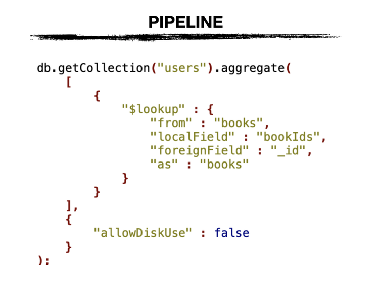
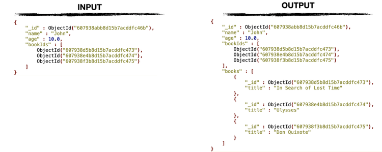

 

  <h1 align="center">MongoDB</h1>

### Indexes

### Aggregate

- All aggregation pipelines are executed sequentially, including `$facet`.

### Lookup

  

  

- Is a `left outer join`.
- localField, foreignField accept array.

### Ref

- [Are MongoDB $facet sub-pipelines asynchronous and executed in parallel?](https://www.mongodb.com/community/forums/t/are-mongodb-facet-sub-pipelines-asynchronous-and-executed-in-parallel/9005)
- [Nghệ thuật index mongodb: 5 kế sách có thể các hạ chưa biết](https://viblo.asia/p/nghe-thuat-index-mongodb-5-ke-sach-co-the-cac-ha-chua-biet-Do754bnXZM6)

(<a href="#top">Back to top</a>)

