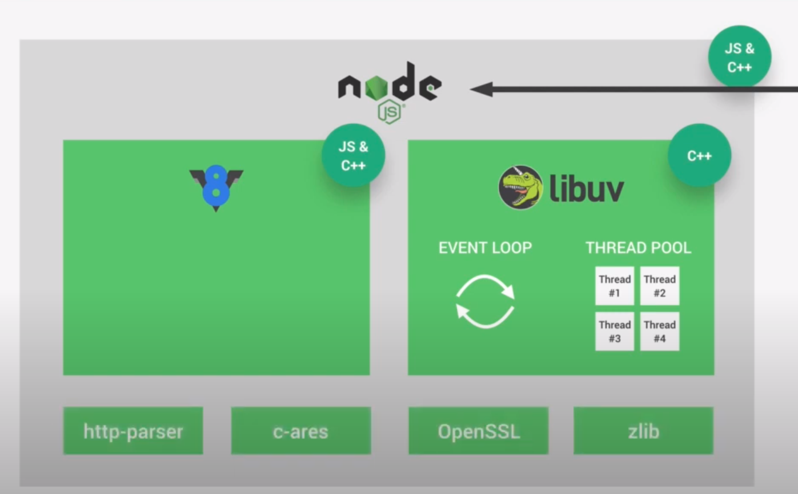
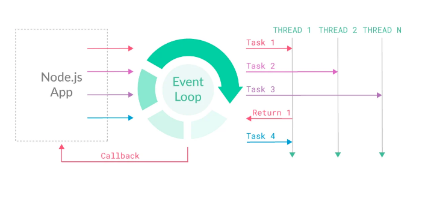
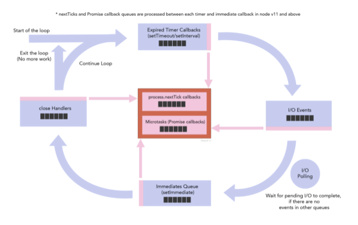

 

  <h1 align="center">Nodejs</h1>

## Main concepts.

### 1. Dependences

    

- #### V8
  `V8` convert JS code to machine code.
- #### Libuv
  `libuv` is a multi-platform support library with a focus on asynchronous I/O.

### 2. Event-loop

    
      
    

### 3. Ref

- [The Node.js Event Loop, Timers, and process.nextTick()](https://nodejs.org/en/docs/guides/event-loop-timers-and-nexttick)

- [Does the nodejs (libuv) event loop execute all the callbacks in one phase (queue) before moving to the next or run in a round robin fashion?](https://stackoverflow.com/questions/60538323/does-the-nodejs-libuv-event-loop-execute-all-the-callbacks-in-one-phase-queue)

- [Faster process.nextTick](https://nodejs.org/en/blog/release/v0.10.0/#faster-process-nexttick)

- [Node.js Event-Loop: How even quick Node.js async functions can block the Event-Loop, starve I/O](https://snyk.io/blog/nodejs-how-even-quick-async-functions-can-block-the-event-loop-starve-io/)
  
(<a href="#top">Back to top</a>)

