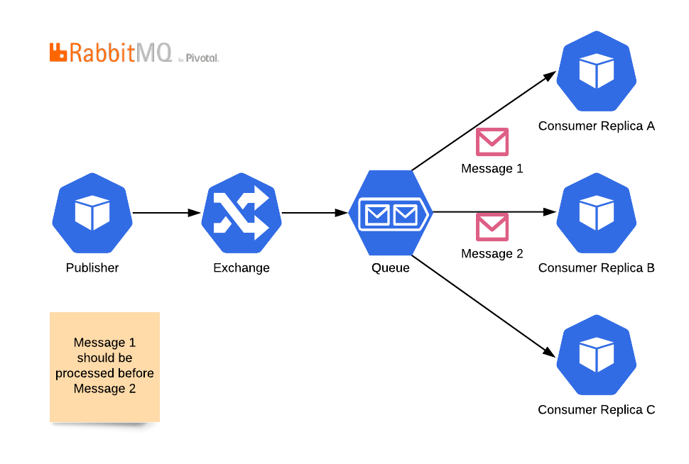
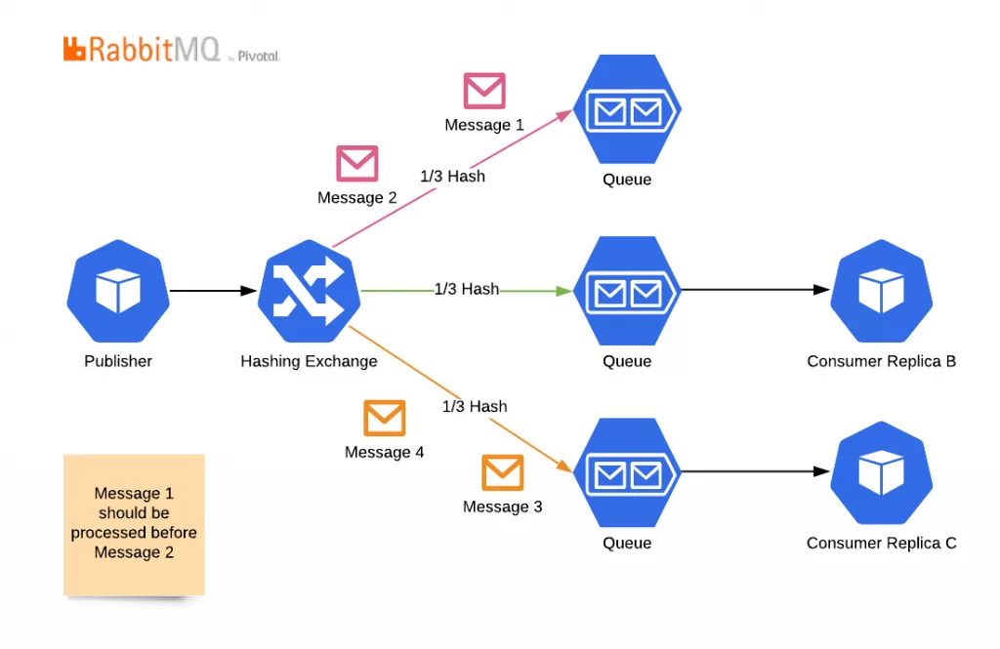
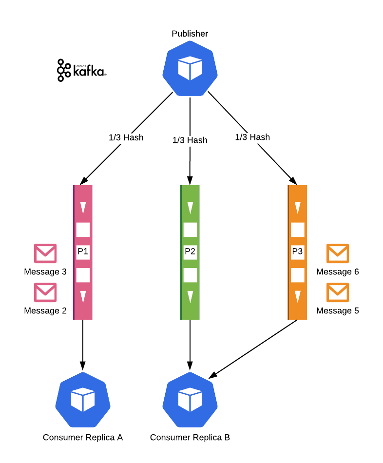
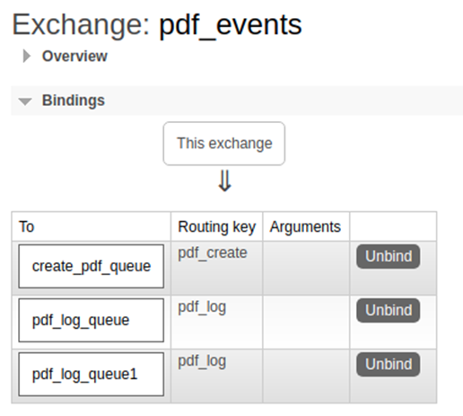
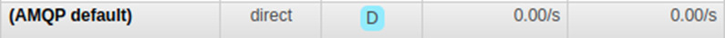
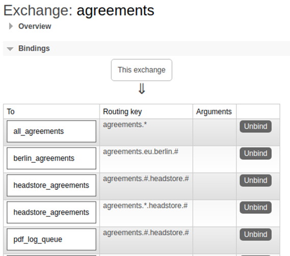
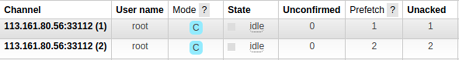
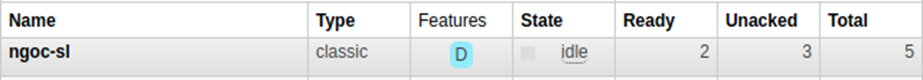

 

  <h1 align="center">Message Queue</h1>

## Kafka vs Rabbit

1. ### Message ordering

- Khi chỉ sử dụng 1 `consumer`, thì thứ tự message đều được đảm bảo ở cả Kafka và Rabbit MQ. Nhưng trong thực tế ta có nhu cầu dùng nhiều `consumer` để tăng tốc độ xử lí.

- Với RabbitMQ, khi dùng nhiều `consumer`, thứ tự xử lí message có thể bị xáo trộn.

  

  Để giải quyết vấn đề bị xáo trộn message, người ta dùng kết hợp các kĩ thuật sau:

  1. **Single Active Consumer**: Đảm bảo 1 `consumer` chỉ lắng nghe 1 queue.
  2. **Hashing Exchange**: Chia các message cùng loại vô cùng 1 queue.

  

  Nhược điểm:

  1. Khi số lượng `consumer` < `queue`: ít nhất 1 `consumer` phải lắng nghe nhiều hơn 1 `queue` để đảm bảo mọi `queue` đều được xử lí.
  2. Khi số lượng `consumer` > `queue`: Số lượng `consumer` không thể lớn hơn số `queue` đã tạo ra ban đầu. Nếu muốn tăng phải sửa thuật toán hashing của `Hashing Exchange` để tăng số lượng `queue`. Vì vậy, khả năng Auto-Scale kém.

- Với `partition`, kafka khiến mọi thứ đơn giản hơn và không bị các nhược điểm trên của rabbitMQ.

  

2. ### Other
   |                              |                      Kafka                       |                    Rabbit                    |
   | :--------------------------: | :----------------------------------------------: | :------------------------------------------: |
   |         Scalability          |                        Dễ                        | Phức tạp hơn, vì phải tạo ra nhiều queue hơn |
   |       Priority message       |                      Không                       |                      Có                      |
   |      Dead letter queue       |                      Không                       |                      Có                      |
   |          Deployment          |                                                  |                 Lightweight                  |
   |         Commit(ack)          | Dựa vào message cuối cùng nhận được trong batch. |             Từng message độc lập             |
   | Publish / Consume dạng batch |                        Có                        |                    Không                     |
   |        Resume/ Pause         |                        Có                        |                    Không                     |

## Rabbit

### 1. Exchange

_An exchange accepts messages from the producer application and routes them to message queues_

_a. Direct Exchange_

  

    
  

- A message `{ routingKey: pdf_create }` → `pdf_events` exchange → `pdf_create_queue`
  queue
- A message `{ routingKey: other }` → `pdf_events` exchange → ❌(discarded)
- A message `{ routingKey: pdf_log }` → `pdf_events` exchange → `pdf_log_queue`,
  `pdf_log_queue1` queues
- Every queue is automatically bound to the `default` exchange with a routing key which
  is the same as the queue name.
    

      
    

  A message `{ routingKey: pdf_log_queue }` → `default` exchange → `pdf_log_queue`
  queue

_a. Topic Exchange_

  

 
|Routing key|Valid|Invalid|
|:---:|:-:|:-:|
|agreements.*|agreements.a, agreements.b|agreements, agreements.a.b|
|agreements.eu.berlin.#|agreements.eu.berlin, agreements.eu.berlin.a, agreements.eu.berlin.a.b|a.agreements.eu.berlin, a.agreements.eu.berlin.b|
|agreements.*.berlin|agreements.a.berlin, agreements.b.berlin|agreements.a.b.berlin, agreements.berlin|
|agreements.#.berlin|agreements.berlin, agreements.a.b.berlin, agreements.a.berlin|agreements.a,agreements.a.berlin.b|
|agreements|agreements|agreements.a, agreements.a.b|

_c. Fanout Exchange_

- A fanout exchange copies and routes a received message to all queues that are
  bound to it. The routing keys provided will simply be **ignored**.

_d. Headers Exchange_

- In this type of exchange the routing queue is selected based on the criteria specified
  **in the headers instead of the routing key**

### 2. Relationship between exchange and queue

- Exchange can bind N queues
- Queue can bind N exchanges (same type or more type). Example, queue can bind
  with both direct exchange and fanout exchange.

### 3. Prefetch

- Prefetch followed by **Channel**
  

    
     
    
  

  `Unacked` of queue = Sum of all consumer’s unacked <= Sum of all consumer’s
  prefetch

- If there are two active consumers, the broker will distribute new messages fairly

### 4. Routing key

_The routing key is a message attribute_

### 5. Message priority

- We can define the queue's priority range `(max_priority)` at the time the queue is
  created.
- Messages where priority is **not set** get a priority of 0.
- Messages with a numeric priority **higher than the maximum** set on the queue get the
  **highest priority** the queue supports.

  Queue:
  `max_priority`: 3

  Publish message with priority: `data`: 0 → `data2`: 2 → `data3`: 3 → `data4`: 4 → `data5`: 5

  Consume: `data3` → `data4` → `data5` → `data2` → `data`

### 6.Dead letter queue

- A dead-letter queue (DLQ), sometimes which is also known as an
  undelivered-message queue, is a holding queue for messages that cannot be
  delivered to their destinations due to some reason or other.
- Just add `deadLetterExchange` & `deadLetterRoutingKey` when creating the queue.

### 7.Commit

- If you don't use `autoCommit` mode. You need to use either the **commit function** or the
  **reject function**. Otherwise, message with unAcked.
- If you manually commit a message 2 times, the channel will die.

### 8. Some notes

- Tham số `Persitant` khi publish giúp dữ liệu không bị mất khi rabbitMQ bị crash.
- Durable queue: the queue will survive a broker restart.
- Auto-delete queue: queue that has had at least one consumer is deleted when last consumer unsubscribes

## Kafka

### 1. Subscribed.

- N instance chung `groupId` (chung `consumer-group`) consume đồng thời vào một topic có M partition. Thì số lượng message nhận được ở mỗi instance phụ thuộc vào mối tương quan giữa N và M, [xem thêm.](https://sagarkudu.medium.com/explain-consumer-group-in-kafka-1c61fa3a77b)
- 2 instance chung `groupId` (chung `consumer-group`) không thể consume đồng thời 2 topic tai 1 thời điểm, [xem thêm](https://github.com/tulios/kafkajs/issues/1040)
- Số message lấy được dạng batch, ta có thể config lại size của batch này nhưng tính theo đơn vị KB chứ không phải số lượng.
- Trong hàm handle message (`eachMessage`, `eachBatch`), nếu bị throw lỗi thì sẽ consume lại message / batch đó.
- Cẩn thận với heatbeat, heartbeat nếu set là 10s, thì sau 10s mà chưa heartbeat, thì sẽ bị lỗi, đánh dấu lần publish nó fail. Hình như không gọi là tự gọi.

### 2.Publish

- Khi publish dữ liệu vô kafka, cần quan tâm **key** của message, **key** này sẽ được băm `murmur2(key) % number_of_partitions` để xác định đi vào partition nào. Nếu không có key thì message sẽ được load balance đều cho các partition, [xem thêm.](https://forum.confluent.io/t/what-should-i-use-as-the-key-for-my-kafka-message/312)
- Giả sử ta có 2 event của một đơn hàng (create - delete), ta phải set **key** cho 2 message chung để cho chúng nó vào chung một partition. Từ đó 2 event sẽ giữ đúng thứ tự, tránh việc event delete đến trước, create đến sau.
- Header thì hình như có đủ thông tin vừa đủ để check ABC mà không cần parse message ra để check.
- Với một topic có thể được đẩy dữ liệu từ nhiều producer khác nhau bởi những nguyên nhân sau:
  - Một topic mà có nhiều format data
  - Hai process khác nhau cùng đẩy data vô. Nếu dùng chung 1 producer sẽ lỗi `write after end`
- Send multi topic có tốc độ nhanh hơn send rời rạc từng topic.

### 3.Partition

- Sau khi tạo topic, ta có thể tăng số partition được, nhưng không giảm được (cơ chế của Kafka cấm để tránh mất dữ liệu trên 1 vài partition).

### 4.Some notes.

- Tham số `allowAutoTopicCreation` của các hàm `publish` và `consume` giúp tạo topic nếu nó chửa tồn tại.

## Ref

- [RabbitMQ : Message Ordering on Multiple Consumers
  ](https://medium.com/batc/rabbitmq-message-ordering-on-multiple-consumers-6f484858f589)
- [Microservice Applications with Kafka and Web-Sockets](https://obss.com.tr/en/developing-event-driven-microservice-applications)
- [Does Kafka support priority for topic or message?](https://stackoverflow.com/questions/30655361/does-kafka-support-priority-for-topic-or-message#:~:text=Kafka%20is%20a%20fast%2C%20scalable,same%20problem%20that%20you%20have)
  
(<a href="#top">Back to top</a>)

